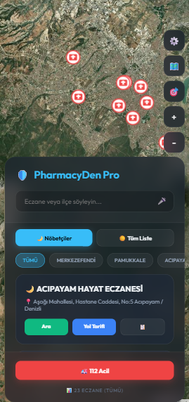

# 📍 PharmacyDen Pro - Denizli Akıllı Eczane Asistanı

**PharmacyDen Pro**, Denizli şehrindeki tüm eczanelere ve güncel nöbetçi eczanelere en hızlı şekilde ulaşmanızı sağlayan, modern arayüzlü ve yüksek performanslı bir web uygulamasıdır. 


---

## ✨ Öne Çıkan Özellikler

*   **🌙 Güncel Nöbetçi Listesi:** CollectAPI entegrasyonu ile Denizli'deki nöbetçi eczanelere anlık erişim.
*   **☀️ Tüm Eczaneler:** Overpass API (OpenStreetMap) üzerinden şehirdeki tüm eczanelerin kapsamlı listesi.
*   **📏 Akıllı Mesafe Hesaplama:** Konumunuzu paylaşın ve size en yakın eczaneden başlayarak sıralanan listeye ulaşın.
*   **🎤 Sesli Arama (Voice Search):** Eczane ismini veya ilçeyi söyleyerek eller serbest arama yapın.
*   **🛰️ Uydu Görünümü:** Tek tıkla standart harita ve uydu görünümü arasında geçiş yapın.
*   **🚑 Acil Durum Paneli:** 112 Acil servis için hızlı erişim butonu.
*   **📋 Adres Kopyalama:** Tek tıkla eczane adresini panoya kopyalayın ve paylaşın.
*   **🎨 Glassmorphism UI:** Modern, şeffaf ve kullanıcı dostu yüzen dashboard tasarımı.

---

## 🛠️ Kullanılan Teknolojiler

*   **Frontend:** HTML5, Vanilla CSS3 (Custom Variables, Animations, Glassmorphism)
*   **Logic:** Vanilla JavaScript (ES6+)
*   **Harita:** Leaflet.js (CartoDB Voyager & Esri Satellite Layers)
*   **Veri Kaynakları:** 
    *   [CollectAPI](https://collectapi.com/) (Nöbetçi Eczane Verileri)
    *   [Overpass API](https://overpass-api.de/) (OSM Eczane Verileri)

---

## 🚀 Kurulum ve Kullanım

Projeyi kendi bilgisayarınızda çalıştırmak veya GitHub'a yüklemek için:

1.  **Repoyu Klonlayın:**
    ```bash
    git clone https://github.com/kullaniciadi/PharmacyDen.git
    ```
2.  **Dosyayı Açın:** `index.html` dosyasını herhangi bir modern tarayıcıda açın.
3.  **API Anahtarınızı Girin:**
    *   Uygulama açıldığında karşınıza çıkacak olan "Hoş Geldiniz" ekranında **CollectAPI** anahtarınızı girin.
    *   Anahtarınız yoksa [CollectAPI](https://collectapi.com/tr/api/health/nobetci-eczane-api) üzerinden ücretsiz alabilirsiniz.

> **Güvenlik Notu:** API anahtarınız kaynak kodda tutulmaz. Tarayıcınızın `localStorage` alanında güvenli bir şekilde saklanır. GitHub'a yüklediğinizde anahtarınız sızdırılmaz.

---

## 📸 Uygulama Ekran Görüntüleri

### 1. Karşılanma ve Kurulum
Uygulama, yeni kullanıcıları modern bir karşılama ekranı ve özellik tanıtımı ile karşılar.
<p align="center">
  
</p>

### 2. Dashboard ve Eczane Listeleri
Şehir genelindeki tüm eczaneler ve güncel nöbetçiler harita üzerinde dinamik olarak listelenir.
| Tüm Eczaneler (Standart) | Nöbetçi Eczaneler (Kırmızı) |
| :---: | :---: |
|  |  |

### 3. Gelişmiş Harita ve Mobil Deneyim
Uydu görünümü ile detaylı inceleme yapabilir veya mobil cihazlardan kolayca erişebilirsiniz.
| Uydu Görünümü | Mobil Arayüz |
| :---: | :---: |
|  |  |


---

## 📄 Lisans

Bu proje MIT Lisansı ile lisanslanmıştır. Daha fazla bilgi için `LICENSE` dosyasına bakabilirsiniz.

---

**Geliştiren:** [Adınız Soyadınız]  
**İletişim:** [E-posta veya LinkedIn Adresiniz]
